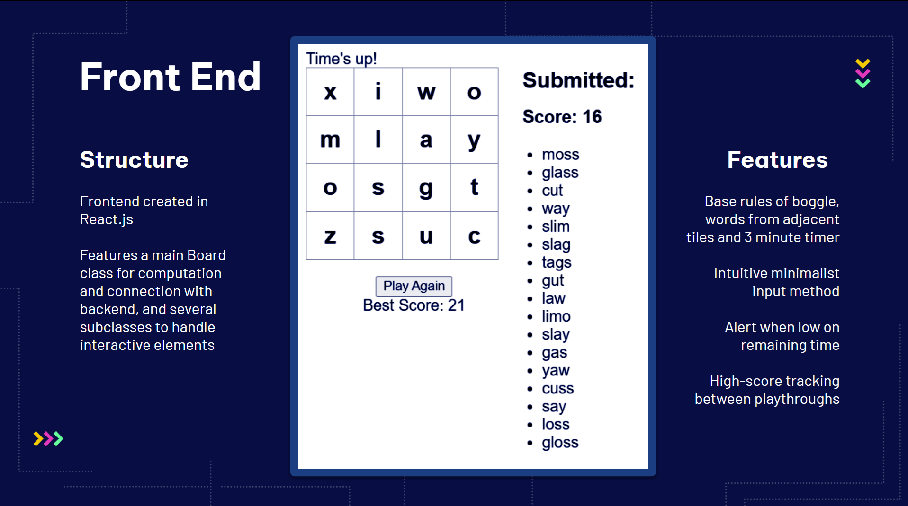
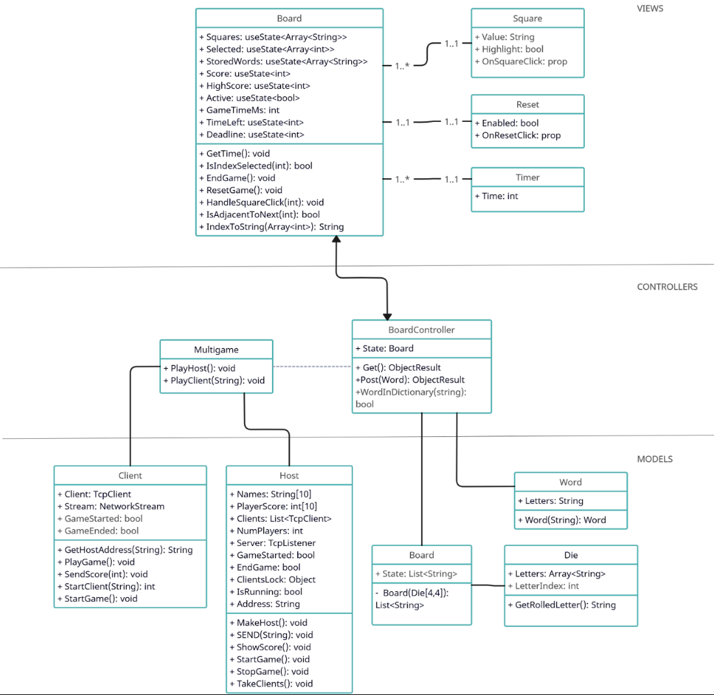

# Online Boggle


<!-- TABLE OF CONTENTS -->
<details>
  <summary>Table of Contents</summary>
  <ol>
    <li>
      <a href="#about-the-project">About The Project</a>
      <ul>
        <li><a href="#authors">Authors</a></li>
        <li><a href="#built-with">Built With</a></li>
      </ul>
    </li>
    <li><a href="#usage">Usage</a>
       <ul>
        <li><a href="#to-run">To run</a></li>
         <li><a href="#to-play">To play</a></li>
      </ul>
    </li>
    <li><a href="#software-architecture">Software Architecture</a></li>
    <li><a href="#testing-and-test-results">Testing</a></li>
  </ol>
</details>

## About The Project
This program implements the online puzzle game Boggle, faithfully replicating the experience of the original pencil-and-paper version. Players compete to find the most words on a randomly generated 4x4 grid of letter cubes. The game supports single player or multiplayer functionality, allowing up to four players to connect and compete over a network using manually-entered address:port information similar to SocketChat.
<p align="right">(<a href="#readme-top">back to top</a>)</p>

### Authors
*   Dylan Bonner
*   Ivy Chobanyan
*   Matthew Geary
*   Nga Pham
*   Bingquan Li
<p align="right">(<a href="#readme-top">back to top</a>)</p>
  
### Built With
* [C#](https://learn.microsoft.com/en-us/dotnet/csharp/)
* [JavaScript](https://www.javascript.com/)
* [HTML](https://developer.mozilla.org/en-US/docs/Web/HTML)
* [CSS](https://developer.mozilla.org/en-US/docs/Web/CSS)
* React.js
<p align="right">(<a href="#readme-top">back to top</a>)</p>

## Usage
### To run:
Standard procedure for a local web app
  1. Build the program
  2. Open command line or Powershell instance
  3. Navigate to the CSCE361-Boggle folder
  4. Execute `dotnet run`
  5. Open a separate instance or terminal
  6. Navigate to CSCE361/frontend1/src
  7. Execute `npm start`
  8. Open a browser of your choice
  9. Connect to localhost:3000
  10. The game should now be active on localhost:3000
<p align="right">(<a href="#readme-top">back to top</a>)</p>

### To play:
- You have 3 minutes to score as many points as possible by forming words from the board
- To form words, click adjacent or diagonal tiles on the board, and double click a tile to submit that word for scoring.
- To undo a selection, click a previous letter in the word and all later letters will be deselected.
- To deselect a whole word, double click the first letter of the word.
- Words that have less than 3 letters long, or words that have already been submitted, or words that are not found in the game's dictionary will not be scored.
- At the end of the game, your high score for that session will be displayed. (Our best was 22 points, can you do better?)
- Click the button above your final score to play again, or close the program when finished playing.
<p align="right">(<a href="#readme-top">back to top</a>)</p>

## Software Architecture
### Model-View-Controller (MVC) framework

<p align="right">(<a href="#readme-top">back to top</a>)</p>

## Testing and Test Results
* Unit Testing for ```BoardController```, ```Client```, ```Die```, ```Host```, and ```Multigame``` class were developed.
* Test cases were structured using Arrange-Act-Assert pattern and MS Test frameworks
* All test cases passed
<p align="right">(<a href="#readme-top">back to top</a>)</p>

